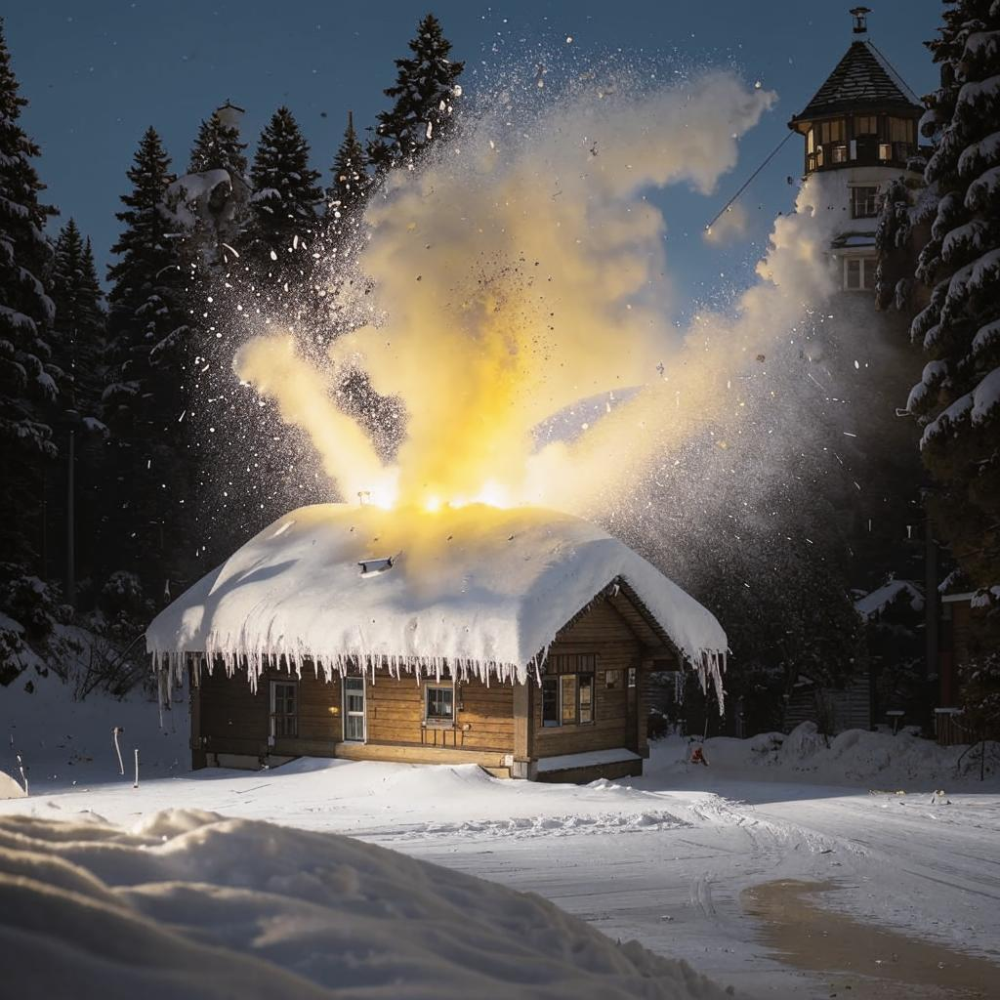

# DedMorozChallenge2024

Чрезвычайное происшествие в деревне Деда Мороза!

Снеговики-помощники, в мастерской где делаются подарки, случайно вместо восковых свечей для освещения использовали волшебные фейерверки.

Фото с места происшествия:

В результате взрыва всем сделанным подаркам было передано волшебное ускорение, которое разметало подарки по всей планете.

До Нового года остается ровно месяц и, чтобы успеть подарить подарки детям, их необходимо собрать. К счастью, координаты нахождения всех подарков удалось установить с помощью волшебного ГЛОНАСС-зеркала.
Собрать подарки силами снеговиков нет никакой возможности, так как все они пострадали от волшебного взрыва.

Со времен карантина у Деда Мороза остались дроны-доставщики https://github.com/kafvtpnz/DedMorozChallenge2021, которые можно использовать для автоматического сбора подарков. Проблема заключается в том, что дроны имеют ограниченную подъемную силу и не могут переносить более 100 кг веса за раз. Лётный ресурс дронов также ограничен, поэтому желательно обеспечить им минимальное полетное время.

Ваша задача - сформировать маршруты передвижения дронов для сбора подарков, имеющие минимальную суммарную длину.  

Координаты подарков и их вес содержатся в файле https://github.com/kafvtpnz/DedMorozChallenge2024/blob/master/gifts.csv.

# Список сформированных путей необходимо сохранить в виде текстового файла.
Формат файла:

1 столбец – номер пути  
2 и далее столбцы – IdПодарков в той последовательности, в которой они должны собираться дронами 
Столбцы отделяются запятыми.

Пример выходного файла https://github.com/kafvtpnz/DedMorozChallenge2024/blob/master/out_example.csv

!!! При подсчете пути важно учитывать, что дрон начинает и заканчивает путь в деревне Деда Мороза в Великом Устюге с координатами: широта 60.7603243, долгота	46.3053893.
!!! Метрика расстояния между двумя точками - расстояние на сфере, вычисленное по формуле гаверсинуса https://en.wikipedia.org/wiki/Haversine_formula. При вычислении расстояния радиус Земли принимать равным 6371 км.

Функция на языке python для вычисления расстояния по формуле гаверсинуса приведена в файле https://github.com/kafvtpnz/DedMorozChallenge2024/blob/master/Calc_distance.py

# Главный приз для автора лучшего решения
"Автомат" за экзамен и курсовой + флешка.

Для авторов 5 лучших решений: "Автомат" за экзамен и курсовой.
